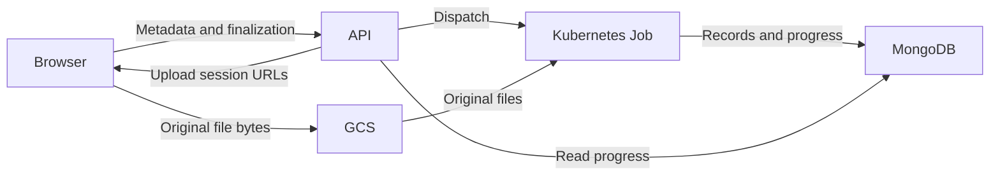
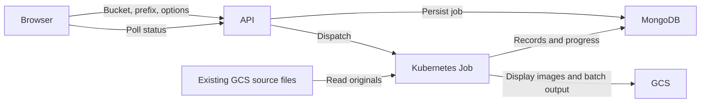

# Uploads and processing

OGRRE separates **file transfer** from **document processing**. A directory on
your computer must finish transferring before its processing job can start.
Files already in Google Cloud Storage (GCS) can go directly to processing.

## Local directory uploads

Select **Local Directory** from a record group's upload dialog. Choose the file
count, duplicate-prevention setting, and cleaning setting, then select **Upload**.

With Google storage and Google Document AI configured, the browser uploads the
original files directly to GCS. The API receives filenames, sizes, upload
options, and status requests. It does not receive the document bytes or convert
images in this workflow.

The steps are:

1. The API checks the user's upload permission and access to the record group,
   then records a manifest of the selected files in MongoDB.
2. For each file, the API grants access to create one specific GCS object.
   Original names and relative paths are kept in the manifest. Separate object
   paths prevent files in different subdirectories from overwriting one another.
3. The browser transfers at most four files at once, using resumable uploads.
4. Once all transfers finish, the API checks the stored objects' size, content
   type, and generation. Repeated finalization returns the same processing job.
5. The API dispatches a worker, or leaves the job queued until capacity is free.
6. The worker creates display images and records, detects whitespace, calls
   Document AI, applies optional cleaning functions, and saves the results.

Supported directory files are PDF, PNG, JPEG, and TIFF. Rename document files
containing `#`, `?`, or `%` before uploading; these characters conflict with the
existing GCS URI processing path. A directory contains at
most 1,000 selected files. Individual files follow the installed Document AI
Toolbox batch size limit; the default total directory limit is 20 GiB, configured
with `DIRECTORY_UPLOAD_MAX_BYTES`. These limits apply to original files, not
expanded images or page count; processor-specific Document AI limits still apply.
The **Upload File** control has its own separate size limit.

**Prevent Duplicates** compares filename bases within the record group. For
example, `well.pdf` and `well.tif` share a base name. The directory selection also
skips repeated bases inside the selected folder when this option is enabled.
The worker checks again before creating records.

### Transfer interruptions

Keep the upload dialog open until transfer and verification finish. **Pause
transfer** stops browser transfers; it does not cancel a processing job. Failed
transfers can be retried without retransferring completed objects.

After refreshing the browser, select the same directory and upload options and
choose **Upload** again. The browser retains the manifest and session ID, but
must obtain file access through the directory picker again. Files must match by
path, size, and modification time. Upload authorization URLs are not stored in
browser storage. In browsers that disable local storage, retry works only while
the current dialog remains open.

An upload session lasts seven days. After expiration, select the directory again
to create a new session. Staged originals and directory-specific Document AI
outputs are eligible for storage cleanup after 14 days.

## GCS directory batches

Choose **GCS Directory** when originals are already in a storage bucket. Enter
the bucket name and optional folder prefix, then use **Check Bucket/Path** to
review the supported file count and duplicate count before submission.

This uses the same processing worker as local directories. It does not require
a browser file transfer, and the worker does not delete or modify the supplied
source files. A prefix is interpreted as a folder boundary. GCS batches can
span multiple Document AI batches; the worker limits concurrent batch operations.

## Processing status and recovery

The upload dialog shows the ten most recent jobs for the current record group,
including jobs submitted before a page refresh. Active jobs refresh every five
seconds; an idle list refreshes every fifteen seconds.

| Status | Meaning |
| --- | --- |
| Waiting for a processing worker | The job is queued behind the environment's active worker limit. |
| Starting processing worker | Dispatch has begun; Kubernetes may still be scheduling the pod. |
| Processing documents | Conversion, whitespace detection, Document AI, or result import is running. |
| Processing complete | All submitted files succeeded or were skipped as duplicates. |
| Processing completed with errors | Some files failed; expand the failed-file list. |
| Processing failed | The worker or job failed; inspect the error before retrying. |

Counts update as each Document AI batch finishes, so they can remain unchanged
while conversion or an external operation is running. Once transfer finishes,
processing continues after closing the dialog or browser. Use **Refresh records**
to reload the record table when results are ready.

For a failed local-directory job, the original uploader can select **Retry failed
processing** during the seven-day session window. Successfully digitized records
are preserved. Failed records reuse their original record IDs, and the worker
reattaches to a recorded, unconsumed Document AI operation instead of submitting
it again. Automatic Kubernetes retries remain disabled. An interrupted external
submission before its operation ID reaches MongoDB requires operator review;
OGRRE cannot guarantee exactly-once submission across that external boundary.

GCS-source batch retries still require operator review and resubmission. In
particular, filename duplicate prevention can skip existing failed records;
turning it off can create duplicate records. Inspect and resolve failed records
before submitting the source batch again.

In GKE, the API reconciles jobs every 30 seconds even with no browser open. A
failed worker releases capacity and its linked records are marked as failed.
Upload and processing metadata remain in MongoDB for diagnosis. Record display
images live under `uploads/<record-group-id>/<record-id>/` and are not affected
by staging cleanup.

## Other upload paths and local development

Single-file and ZIP uploads still use the original API processing path. ZIP
extraction, record-image uploads, image rotation, imports, and exports can also
use API resources. Moving directory uploads therefore does not by itself prove
that a smaller API memory limit is safe.

With local storage or a custom Document AI backend and
`PROCESSING_JOB_MODE=background`, directory uploads use the original per-file
API path with one upload request at a time. This development fallback does not
provide pod isolation or durable execution across process restarts. GKE does
not silently fall back to API processing when direct uploads are unavailable.

For Google-backed local development, transfers still go directly to GCS, while
`PROCESSING_JOB_MODE=background` executes processing in the API process after
the response. Production uses `PROCESSING_JOB_MODE=kubernetes`.

See [Backend on GKE](../deploy-gcp/backend-gke.mdx) for bucket CORS, runtime
permissions, staging retention, deployment order, and resource validation.
