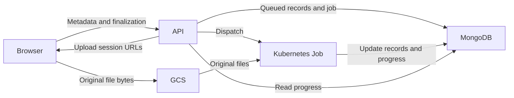
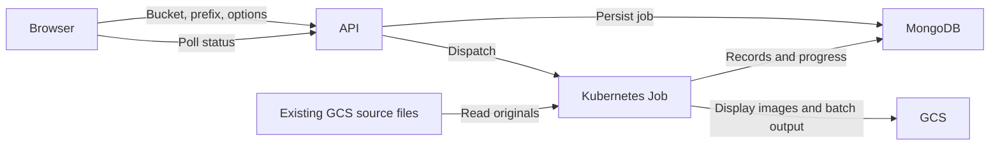

# Uploads and processing

OGRRE separates **file transfer** from **document processing**. A directory on
your computer must finish transferring before its processing job can start.
Files already in Google Cloud Storage (GCS) can go directly to processing.

On a record-group page, users with upload permission see **Upload new record(s)**
disabled while group details load. Once loaded, it enables document uploads for
groups with a processor or becomes **Import JSON/CSV records** for groups without one.

## Local directory uploads

Select **Local Directory** from a record group's upload dialog. Choose the file
count, duplicate-prevention setting, and cleaning setting, then select **Upload**.

With Google storage and Google Document AI configured, the browser uploads the
original files directly to GCS. The API receives filenames, sizes, upload
options, and status requests. It does not receive the document bytes or convert
images in this workflow.

The steps are:

1. The API checks the user's upload permission and access to the record group,
   then records a manifest of the selected files in MongoDB.
2. For each file, the API grants access to create one specific GCS object.
   Original names and relative paths are kept in the manifest. Separate object
   paths prevent files in different subdirectories from overwriting one another.
3. The browser transfers at most four files at once, using resumable uploads.
4. Once all transfers finish, the API checks the stored objects' size, content
   type, and generation, then creates metadata-only records marked **queued**.
   Repeated finalization returns the same job and records.
5. The API dispatches a worker, or leaves the job queued until capacity is free.
6. The worker prepares display images and changes those records to **processing**,
   detects whitespace, calls Document AI, applies optional cleaning functions,
   and saves the results. Records become **digitized** or **error**.

The record table shows queued records after verification, including while a job
waits for a worker. File bytes and image conversion remain outside the API.
Records keep the same IDs and record numbers through preparation and retries.
Files that fail during download or conversion remain visible as error records.

Supported directory files are PDF, PNG, JPEG, and TIFF. Rename document files
containing `#`, `?`, or `%` before uploading; these characters conflict with the
existing GCS URI processing path. A directory contains at
most 1,000 selected files. Individual files follow the installed Document AI
Toolbox batch size limit; the default total directory limit is 20 GiB, configured
with `DIRECTORY_UPLOAD_MAX_BYTES`. These limits apply to original files, not
expanded images or page count; processor-specific Document AI limits still apply.
The **Upload File** control has its own separate size limit.

**Prevent Duplicates** compares filename bases within the record group. For
example, `well.pdf` and `well.tif` share a base name. The directory selection also
skips repeated bases inside the selected folder when this option is enabled.
The API records duplicate decisions during finalization before creating pending
records, so a retry does not treat its own records as duplicates. Files skipped
as duplicates do not receive new records.

### Transfer interruptions

Keep the upload dialog open until transfer and verification finish. **Pause
transfer** stops browser transfers; it does not cancel a processing job. Failed
transfers can be retried without retransferring completed objects.

After refreshing the browser, select the same directory and upload options and
choose **Upload** again. The browser retains the manifest and session ID, but
must obtain file access through the directory picker again. Files must match by
path, size, and modification time. Upload authorization URLs are not stored in
browser storage. In browsers that disable local storage, retry works only while
the current dialog remains open.

An upload session lasts seven days. After expiration, select the directory again
to create a new session. Staged originals and directory-specific Document AI
outputs are eligible for storage cleanup after 14 days.

## GCS directory batches

Choose **GCS Directory** when originals are already in a storage bucket. Enter
the bucket name and optional folder prefix, then use **Check path** to review
the supported file count and duplicate count. **Start processing** is enabled
only after a successful check finds files to submit and the processor is deployed.
A path with no supported files, or only duplicates with **Prevent Duplicates**
enabled, cannot be submitted. Changing the bucket name, prefix/folder path, or
**Prevent Duplicates** requires another check. Changing **Run cleaning functions**
preserves the check.

This uses the same processing worker as local directories. It does not require
a browser file transfer, and the worker does not delete or modify the supplied
source files. A prefix is interpreted as a folder boundary. GCS batches can
span multiple Document AI batches; the worker limits concurrent batch operations.

## Processing status and recovery

The upload dialog shows only the current submission. Its desktop layout has a
fixed header, footer, file-list region, and status region; loading responses and
changes in file count do not resize or recenter it. On small screens it fills
the viewport. The form body and file list scroll while actions remain visible.
Source tabs sit below the title; the compact processor status menu contains the
existing deploy/undeploy controls.

Selecting **Deploy processor** immediately shows **Processor deploying** and
disables deployment controls while the request and deployment are in progress.
The dialog checks for completion automatically; no refresh is needed. Missing,
failed, or unavailable processors show **Processor unavailable** with details
and **Retry status check** in the status menu, instead of loading indefinitely.

Open **Admin → Upload history**, or follow **Upload history** in the dialog
footer. By default, history includes uploads across all projects you can access
in your current team. Each upload identifies its project and record group; the
record group name links to its records. Project and record-group selections
filter both **Active uploads** and **Finished uploads**. The record group's
actions menu opens this tab with that group already selected.

Both lists use server pagination (25 jobs per page). Additional finished-job
filters cover status, source, uploader, and submission date; they never hide
active uploads within the selected projects/groups. Jobs are shown newest first.
An older active job remains accessible even after many newer jobs.

Admin tabs follow the URL: `/admin` (or `?tab=users`) opens **Users**,
`/admin?tab=roles` opens **Roles & Permissions** for users with that permission,
and `/admin?tab=uploads` opens **Upload history**. Optional `project` and
`record_group` parameters preserve the history selection. Job details add `job`
and `job_group`, preserving the surrounding filters. Browser refresh and
back/forward navigation retain these selections. Old record-group history URLs
redirect to the corresponding Admin view. Reading upload history requires
project access; moving it into Admin does not grant user or role management rights.

Open **Details** to see source paths, counts, timestamps, errors, and paginated
created records, directory manifest, failed files, or skipped duplicates. Existing
records link directly to their record pages. A GCS batch's file count remains
**Pending discovery** until its worker discovers the source files.

History and details refresh every five seconds while work is active and the
browser tab is visible. Refreshes preserve existing rows. Settled views stop
polling; use **Refresh uploads** above the lists or **Refresh** in details,
or return to the tab to fetch new information. The page URL can link directly
to a job's details after a browser refresh.

History covers directory uploads using the worker path and GCS batches after
submission. Single-file/ZIP uploads, record-image attachments, imports, and the
local-storage directory fallback are not tracked here. Incomplete browser
transfers are not processing jobs yet.

| Status | Meaning |
| --- | --- |
| Waiting for a worker | The job is queued behind the environment's active worker limit. |
| Starting worker | Dispatch has begun; Kubernetes may still be scheduling the pod. |
| Processing | Conversion, whitespace detection, Document AI, or result import is running. |
| Complete | All submitted files succeeded or were skipped as duplicates. |
| Completed with errors | Some files failed; open Details and select Failed files. |
| Failed | The worker or job failed; inspect the error before retrying. |

Counts update as each Document AI batch finishes, so they can remain unchanged
while conversion or an external operation is running. Once transfer finishes,
processing continues after closing the dialog or browser. The record-group table
refreshes every five seconds while processing is active, including when active
records are outside its current page or filters, and stops after fetching the
finished results. It also checks while the upload dialog is open. These updates
preserve filters, pagination, and existing rows. The table is still subject to
your current filters and sort order; queued records can be on another page.
Use **View records** to return to the record group.

Details show the worker start time and last reported activity (preparing images,
waiting for Document AI, or saving/cleaning results). These are activity events,
not a heartbeat or a processing percentage. Concurrent batches can report
different stages; the display shows the most recently reported activity.
Older jobs may have no activity timestamp. Elapsed time alone does not establish
that a job failed, and the UI does not force-restart active jobs.

For a failed local-directory job, the original uploader can select **Retry failed
processing** in **Upload history → Details** during the seven-day session window.
When retry is unavailable, details explain whether the cause is ownership,
permission, expiration, or an unconfirmed/still-stopping worker. Successfully digitized records
are preserved. Failed records reuse their original record IDs, and the worker
reattaches to a recorded, unconsumed Document AI operation instead of submitting
it again. Automatic Kubernetes retries remain disabled. An interrupted external
submission before its operation ID reaches MongoDB requires operator review;
OGRRE cannot guarantee exactly-once submission across that external boundary.

GCS-source batch retries still require operator review and resubmission. In
particular, filename duplicate prevention can skip existing failed records;
turning it off can create duplicate records. Inspect and resolve failed records
before submitting the source batch again.

In GKE, the API reconciles jobs every 30 seconds even with no browser open. A
failed worker releases capacity and its linked records are marked as failed.
Upload and processing metadata remain in MongoDB for diagnosis. Record display
images live under `uploads/<record-group-id>/<record-id>/` and are not affected
by staging cleanup.

## Other upload paths and local development

Single-file and ZIP uploads still use the original API processing path. ZIP
extraction, record-image uploads, image rotation, imports, and exports can also
use API resources. Moving directory uploads therefore does not by itself prove
that a smaller API memory limit is safe.

With local storage or a custom Document AI backend and
`PROCESSING_JOB_MODE=background`, directory uploads use the original per-file
API path with one upload request at a time. This development fallback does not
provide pod isolation or durable execution across process restarts. GKE does
not silently fall back to API processing when direct uploads are unavailable.

For Google-backed local development, transfers still go directly to GCS, while
`PROCESSING_JOB_MODE=background` executes processing in the API process after
the response using the API's existing Mongo connection. Local worker-startup
errors are recorded on the job; temporary failures writing that error are retried
while the API process remains running. Local execution does not survive stopping
or reloading the backend. Production uses `PROCESSING_JOB_MODE=kubernetes`.

See [Backend on GKE](../deploy-gcp/backend-gke.mdx) for bucket CORS, runtime
permissions, staging retention, deployment order, and resource validation.
