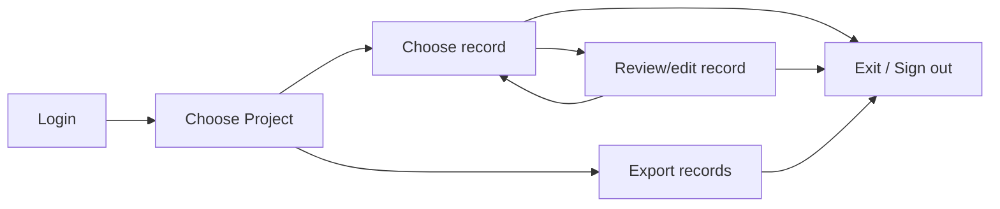

import {
  ProjectExportImg,
  ProjectListImg,
  ProjectReportsImg,
  ProjectReviewImg,
  ProjectViewImg,
  UploadDocumentImg,
  UploadDirectoryImg,
  GcsUploadImg
} from "../screenshots.jsx";

# Overview

OGRRE provides a web-based graphical user interface (which should function well in any modern web browser)
for uploading, reviewing, and editing processed documents. Note: in this page,
the term 'OGRRE' is sometimes used as shorthand for the OGRRE User Interface.

## Workflow

Below is a summary of the basic workflow for using the OGRRE UI.

## Terminology

Below are the terms used in the tool and throughout this guide.

|Term|Definition|
|----|----------|
|Project|Shared workspace for working on records|
|Document Type|Grouping of similar documents, e.g., "well completion report"|
|Digitize|Intelligently convert an image to corresponding text values|
|Processor|External tool that reads digitizes the supported types of scanned document images |
|Record|An uploaded document digitized by the processor|
|Attribute|One digitized name and value from the document|
|Confidence|The degree of certainty the tool (or human, if set manually) has in the predicted digitized attribute values|

## Login to OGRRE

Navigate to the URL of the OGRRE deployment you are using, then
login using your Google credentials.
You will need to have been added by an administrator as a valid user of this deployed instance.

## Upload documents

*To upload records, a user must have **team_lead** or **sys_admin** role.* \
Navigate to the record group that you would like to upload documents to. Click on `Upload New Record(s)`. You will see a modal with the processor status, the document upload area, and three upload options:

<UploadDocumentImg/>

If the processor is not deployed, click on `Deploy Processor`. It may take a couple minutes for the processor to deploy. \
Once the processor is deployed, choose one of the supported upload methods:

- `Upload File`: upload one supported file from your machine. Drag a file into the upload area or click `Browse files`, then click `Upload File`. Supported file types are TIFF, TIF, PDF, PNG, JPG, JPEG, and ZIP, with a maximum file size of 10 MB.
- `Local Directory`: upload supported files from a folder on your machine. After selecting a directory, choose how many files to upload, review the file list, and optionally leave `Prevent Duplicates` enabled so OGRRE skips filenames already present in the current record group.
- `GCS Directory`: start a batch upload from Google Cloud Storage. Enter the bucket name without `gs://` and, if needed, enter a prefix or folder path. Click `Check Bucket/Path` to confirm how many supported files will be submitted, then click `Start Batch Processing`.

For all upload methods, the `Run cleaning functions` switch controls whether OGRRE runs the cleaning functions defined in the processor schema for the uploaded records.

The local directory option shows the selected directory, the number of files that will be uploaded, and duplicate-prevention controls before upload:

<UploadDirectoryImg/>

The GCS directory option is intended for larger batches that are already staged in a Google Cloud Storage bucket:

<GcsUploadImg/>

When ready, click the upload or batch-processing button for the selected method and document processing will begin.

## Review records

## Choose a project

Records are organized into projects.
Start by selecting the project in the list.

<ProjectListImg />

This will open the **project view**, showing all the records in the project.

<ProjectViewImg />

The meaning of the columns in this view are as follows:

|Column|Description|
|------|-----------|
|Record Name|Name of file uploaded|
|Date Uploaded|When the file was uploaded|
|API Number|Well API Number available from the uploaded file|
|Confidence|For each attribute digitized, the associated confidence % given by processor|
|Mean Confidence|Mean of all digitized attributes’ confidence values in that record|
|Lowest Confidence|Lowest of all the confidence values in the record|
|Notes|Notes added to the record|
|Digitization Status|Status of record in tool: uploading/ processing/ digitized|
|Review Status|Status of review for the record: unreviewed/ reviewed|

## Choose a record

Selecting a record from the project (row in the table) to review will open the **record details view**,
which allows review and editing of a single record.

## Review/edit record

Below is an example digitized record on the record details view page.

<ProjectReviewImg />

### Layout

  - The digitized values are on the left scrollable section and the uploaded document is on the right.
  - The two sides are linked: selecting attributes on the left will highlight the place where it came from in the document on the right

### Contents

The meaning of the columns in the table on the left-hand side are as follows:

|Column|Description|
|------|-----------|
|Attribute|Name of the attribute in the database (and exported data)|
|Value|Digitized value detected for this attribute|
|Confidence|Confidence assigned by the processor. Some attributes with values may have low confidence. Values not found will have 0 confidence.|

### Actions

* Selecting a row in the table will highlight that attribute value in the image on the right panel.
* Clicking on a value will let you edit the value.
* You can edit and correct any wrong values detected by processor, or add values for attributes not detected.
* Complex tabular attributes are collapsed by default, and expand on clicking the row
* For each record, you could add notes by clicking ‘Notes’ button in the toolbar at the bottom and saving them. You could revisit the notes by clicking on same button again for the record. These notes are also accessible from Records list view.

Keyboard shortcuts:
|Windows Key|Mac Key|Action|
|-----------|-------|------|
|Up arrow|Up arrow|Previous row in table|
|Down arrow|Down arrow|Next row in table|
|Enter|Enter|Edit the value of highlighted attribute, or while editing to save|
|Esc|Esc|While editing, do not save the edited value|
|Ctrl + Shift + Right arrow|Cmd + Shift + Right arrow|Mark as reviewed & Go to next record|
|Ctrl + Left arrow|Cmd + Left arrow|Go to previous record|
|Ctrl + Right arrow|Cmd + Right arrow|Go to next record|

### Review status

A record can be in one of the following review statuses:

* Unreviewed
* Incomplete
* Reviewed
* Defective

## Export records

You can export all the record data in a project with the `Export Project` button from any view containing the records table, including the **project** and **record group** page.

<ProjectExportImg />

You can select attributes to include in the exported data.

The *CSV* option will export the values from each record as a comma-separated values table, whereas
the *JSON* option will export the values along with additional metadata about confidence
as a JSON (JavaScript Object Notation) object. Either of these formats can be read easily
using Python, and of course CSV is easily imported in Excel, Google Sheets, etc. Additionally, you can choose to export the document image files along with the extracted values.

## Exit / Sign out

To logout you can close the window. Since the program uses Google credentials, if you 
sign out of your Google account you will need to login again on the next visit.
