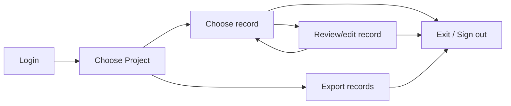

import {
  ProjectExportImg,
  ExportFieldSelectionImg,
  ExportSelectedRecordGroupsImg,
  ProjectListImg,
  ProjectReviewImg,
  ProjectViewImg,
  UploadDocumentImg,
  UploadDirectoryImg,
  GcsUploadImg
} from "../screenshots.jsx";

# Overview

OGRRE provides a web-based graphical user interface (which should function well in any modern web browser)
for uploading documents, importing extracted data, and reviewing and editing records. Note: in this page,
the term 'OGRRE' is sometimes used as shorthand for the OGRRE User Interface.

## Workflow

Below is a summary of the basic workflow for using the OGRRE UI.

## Terminology

Below are the terms used in the tool and throughout this guide.

|Term|Definition|
|----|----------|
|Project|Shared workspace for working on records|
|Record group|A collection of records within a project, with an optional processor and schema|
|Document Type|Kind of document in a record group, e.g., "well completion report"|
|Digitize|Intelligently convert an image to corresponding text values|
|Processor|External tool that extracts fields from supported types of scanned documents|
|Record|Extracted data for one document, imported from JSON/CSV or digitized by a processor, with optional document images|
|Attribute|One digitized name and value from the document|
|Confidence|The degree of certainty the tool (or human, if set manually) has in the predicted digitized attribute values|

## Login to OGRRE

Navigate to the URL of the OGRRE deployment you are using, then
login using your Google credentials.
You will need to have been added by an administrator as a valid user of this deployed instance.

## Upload documents

You need access to the project and the `upload_document` permission. Navigate to
the record group and click **Upload new record(s)**. The **Upload records** dialog
shows three source tabs and the processor status at the top right.

Document uploads require a connected processor. For existing extracted data,
use [Importing JSON/CSV records](./import_records.mdx). That workflow also covers
adding images and connecting a processor later.

<UploadDocumentImg/>

If the processor is undeployed, open its status menu and select **Deploy processor**.
Wait for **Processor deployed**; the status updates automatically. If the status
shows **Processor unavailable**, open the menu for details and **Retry status check**.

### File / ZIP

Drag one file into the upload area or click **Browse files**, then click
**Upload file**. Supported file types are PDF, TIFF/TIF, PNG, JPG/JPEG, and ZIP,
with a maximum size of 10 MB. A ZIP can contain multiple supported documents.

### Local directory

Click **Local directory** and choose a folder on your computer. Review the
selected files and set **Upload amount**. Leave **Prevent Duplicates** enabled
to skip matching filenames in this record group and repeated filenames in the
selection. The comparison ignores paths and the final file extension.

<UploadDirectoryImg/>

Click **Upload** and keep the dialog open until file transfer and verification
finish. **Pause transfer** stops browser transfer, not processing. To resume after
a refresh, select the same directory and options again. Limits depend on the
environment; the dialog reports files that exceed them.

### GCS directory

Use **GCS directory** for supported documents already in Google Cloud Storage.
Enter **Bucket name** without `gs://` or a folder path. Enter an optional
**Prefix or folder path** to restrict the upload to part of the bucket.

<GcsUploadImg/>

Click **Check path** and review the supported-file, duplicate, and submission
counts. Leave **Prevent Duplicates** enabled to skip records with matching
filenames, then click **Start processing**. Changing the bucket, prefix, or
duplicate setting requires another **Check path** before processing can start.

### Cleaning and progress

For each source, **Run cleaning functions** controls whether OGRRE applies the
cleaning functions from the processor schema to the extracted fields.

For directory and GCS jobs, the dialog shows the current job after submission.
Processing continues after file transfer finishes and the dialog closes. Open
**Upload history** in the dialog footer or **Admin → Upload history** to check
progress, failures, and job details. To show only this record group, use the
three-dot **Actions → Upload history** menu beside the group name.

Upload history covers directory uploads using processing jobs and GCS batches.
Single-file/ZIP uploads, JSON/CSV imports, record-image attachments, and the
local-storage directory fallback are not listed there; check the records table
for their results.

For transfer interruptions, retry behavior, limits, and diagrams explaining both workflows, see [Uploads and processing](../concepts/upload-processing.mdx).

## Review records

## Choose a project

Records are organized into projects.
Start by selecting the project in the list.

<ProjectListImg />

This will open the **project view**, showing all the records in the project.

<ProjectViewImg />

The meaning of the columns in this view are as follows:

|Column|Description|
|------|-----------|
|Record Name|Name of file uploaded|
|Date Uploaded|When the file was uploaded|
|API Number|Well API Number available from the uploaded file|
|Confidence|For each attribute digitized, the associated confidence % given by processor|
|Mean Confidence|Mean of all digitized attributes’ confidence values in that record|
|Lowest Confidence|Lowest of all the confidence values in the record|
|Notes|Notes added to the record|
|Digitization Status|Status of record in tool: uploading/ processing/ digitized|
|Review Status|Status of review for the record: unreviewed/ reviewed|

## Choose a record

Selecting a record from the project (row in the table) to review will open the **record details view**,
which allows review and editing of a single record.

## Review/edit record

Below is an example digitized record on the record details view page.

<ProjectReviewImg />

### Layout

  - The digitized values are on the left scrollable section and the uploaded document is on the right.
  - The two sides are linked: selecting attributes on the left will highlight the place where it came from in the document on the right

### Contents

The meaning of the columns in the table on the left-hand side are as follows:

|Column|Description|
|------|-----------|
|Attribute|Name of the attribute in the database (and exported data)|
|Value|Digitized value detected for this attribute|
|Confidence|Confidence assigned by the processor. Some attributes with values may have low confidence. Values not found will have 0 confidence.|

### Actions

* Selecting a row in the table will highlight that attribute value in the image on the right panel.
* Clicking on a value will let you edit the value.
* You can edit and correct any wrong values detected by processor, or add values for attributes not detected.
* Complex tabular attributes are collapsed by default, and expand on clicking the row
* For each record, you could add notes by clicking ‘Notes’ button in the toolbar at the bottom and saving them. You could revisit the notes by clicking on same button again for the record. These notes are also accessible from Records list view.

Keyboard shortcuts:
|Windows Key|Mac Key|Action|
|-----------|-------|------|
|Up arrow|Up arrow|Previous row in table|
|Down arrow|Down arrow|Next row in table|
|Enter|Enter|Edit the value of highlighted attribute, or while editing to save|
|Esc|Esc|While editing, do not save the edited value|
|Ctrl + Shift + Right arrow|Cmd + Shift + Right arrow|Mark as reviewed & Go to next record|
|Ctrl + Left arrow|Cmd + Left arrow|Go to previous record|
|Ctrl + Right arrow|Cmd + Right arrow|Go to next record|

### Review status

A record can be in one of the following review statuses:

* Unreviewed
* Incomplete
* Reviewed
* Defective

## Export records

Click **Export** above a records table to choose the output formats and fields,
then click **Export Data** to download a ZIP archive. JSON is selected by default,
along with all available fields and **User Notes**.

<ProjectExportImg />

### Choose which records to export

| Where you open Export | Records included |
| --- | --- |
| Project → **All Records** | Records in that project matching the table's applied filters. |
| A record group | Records in that group matching the table's applied filters. |
| **Records** in the header | Accessible records in the current team matching the table's applied filters. |
| Project → **Record Groups** | Records in the groups whose row checkboxes you selected. Select at least one group to enable Export. |

Exports from a records table use its applied filters and sort order across all
matching records, including records on other pages. Changing **Rows per page**
does not limit an export. Apply filters before opening the dialog if you want a
smaller subset.

When exporting selected record groups, the dialog shows the selected-group count
and organizes fields by document type. Use the arrows beside document-type names,
or **Collapse All / Expand All**, to navigate those sections. Collapsing a section
does not deselect its fields.

<ExportSelectedRecordGroupsImg />

### Export formats

Select one or more formats. All selected outputs are packaged into the same ZIP.

| Option | What it contains |
| --- | --- |
| **csv** | One row per record with the selected field values, a `file` column, and a `URL` linking back to the record. Useful in Excel, Google Sheets, and other spreadsheet tools. Schema aliases are used as column headings when available; nested fields use bracketed headings such as `receipt_from_other_source[facility_name]`. |
| **json** | An array of records containing the source filename and selected attribute objects. These preserve values, keys, nested subattributes, and available page and coordinate metadata. The current export does **not** include confidence scores or raw-text values. |
| **image files** | The document page images stored in OGRRE, under `documents/<record name>/` in the ZIP. These are the stored display images, which may have been converted from the original PDF or TIFF during upload. |
| **Embedded PDF Files** | Generates a PDF from each record's stored page images and embeds a searchable text layer from its extracted fields. Available PDFs are placed under `documents/<record name>/` with a `_searchable.pdf` suffix. |

Project-wide and team-wide CSV exports are separated by document type; their JSON
export is a single file. A record-group export, or an export from selected record
groups, combines the matching records into one file for each selected data format.

Embedded PDFs require PDF-embedding support on the server. Searchable text depends
on the record having page and coordinate metadata; this option does not run new
OCR. Records without images cannot produce image or PDF files. If PDF generation
is unavailable or fails, the ZIP can still download without PDFs; check its
contents and ask your administrator to inspect the server logs when expected
PDFs are missing.

### Select attributes and notes

- **User Notes** includes active record notes in the CSV or JSON. CSV stores them
  as text with the author; JSON preserves the note objects. Deleted notes are
  excluded. This setting is separate from field selection.
- **Select All Fields in the Records** selects or clears all attribute fields.
  For selected record groups, the label is **Select All Fields from all Document
  Types**. It applies to the full field list, including fields hidden by search.
- **Search Field Name** narrows the displayed field list. Searching does not
  change which fields are selected or filter the records themselves.
- Individual checkboxes select fields. Table fields show their children indented
  beneath the parent; toggling a parent toggles its child checkboxes. A dash
  indicates a partial selection.

<ExportFieldSelectionImg />

For nested data, select the parent field to include the table. The current
exporter includes all children of a selected parent; individual child checkboxes
do not trim its exported contents. Selecting only a child without its parent
does not export that table. If you need specific child columns, export the parent
and remove unwanted columns from the downloaded data.

For CSV or JSON, leave at least one field or **User Notes** selected. Clearing
every field and User Notes currently falls back to exporting all fields and notes.
Field and note selections do not remove content from exported images or embedded
PDFs.

### Download and check the archive

Click **Export Data** after choosing your options. When images or embedded PDFs
are selected, OGRRE first estimates the image download size; preparation may take
longer than a data-only export. A progress indicator appears while the download
runs. You can continue using OGRRE, but keep the browser tab open and avoid
refreshing until the ZIP finishes downloading.

If an export fails, the export dialog stays open and displays an error. Click
**Export Data** again to retry.

Extract the ZIP and check that it contains the formats and records you intended.
Image exports may include a `zip_log_*.txt` file with transfer details. The
exported JSON or CSV can be imported into OGRRE again; see
[Importing JSON/CSV records](./import_records.mdx) for supported formats and how
to attach document images separately.

## Exit / Sign out

To logout you can close the window. Since the program uses Google credentials, if you 
sign out of your Google account you will need to login again on the next visit.
