# OGRRE UI Common Issues

Our platform utilizes advanced AI-powered Optical Character Recognition (OCR)models to enhance the efficiency and accuracy of data extraction. However, like any sophisticated tool, users may encounter various issues that arise from different aspects of the system.

Here we list common issues users may stumble upon, we categorize these issues into three primary areas: 

1. **Design Issues**: Issues arising due to intentional design of the tool’s interface.  
2. **Model Issues**: Issues due to limitations of the AI models and frameworks used for OCR recognition.  
3. **Schema Issues**: Issues related to structured format and expected field arrangements for the different document types processed by the tool.

**Issues Table Overview:**

|  | Column | Description |
| :---- | :---- | :---- |
| 1 | Issue  | Title to identify issue |
| 2 | Example | Image illustrating the issue with a brief explanation |
| 3 | Fixable | Is the issue fixable? (Yes/No) |
| 4 | Notes | Additional information about the issue |
| 5 | Way Around | Suggested solutions or alternative methods to address the problem. |

 

#  Design Issues:

|  | Issue | Example | Fixable | Notes | Way Around |
| :---- | :---- | :---- | :---- | :---- | :---- |
| 1 | Checkbox has 2 fields instead of one  | Two fields detected instead of one boolean:  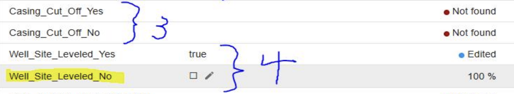 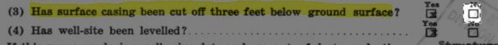| Not as of now. | Processor limitation necessitated splitting this into two fields.    Additional processing to merge two fields into one is possible, but is a larger effort for OGRRE team, and needs schema discussions to discuss feasibility | OGRRE users can write post processing scripts or excel formulas for the exported data, to merge these values into one boolean field. |
| 2 | Complex fields broken into multiple sectional fields instead of one |  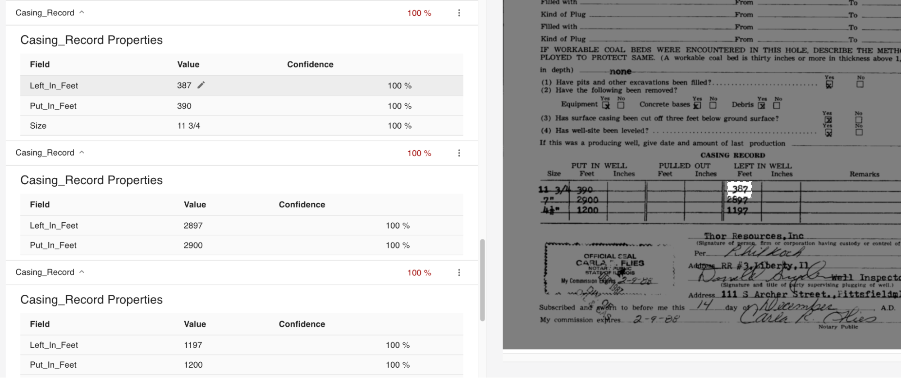| No | This is by design of the tool, and was necessary to support  showing the confidence and raw value fields for all the sub-values | NA |
| 3 | Auto-cleaning edits the value incorrectly or in incorrect format | Even if value is manually edited, auto-cleaning edits it to something else:   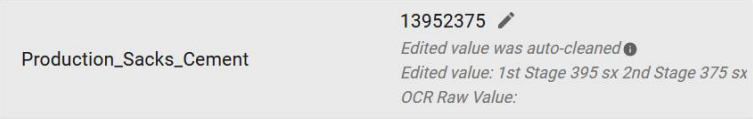| Yes | Raise issue to discuss auto-cleaning function for this field Auto-cleaning function needs to update the acceptable value formats | ⚠️Contact OGRRE team to fix this issue ⚠️    No way around. Mark the record to revisit after discussing with the OGRRE team. |
| 4 | Some fields are marked as not detected and have no location mapped,  but have incorrect value |  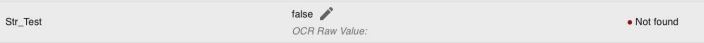| Yes | Mostly an auto-cleaning issue. Raise issue to discuss auto-cleaning function for this field if it happens every time. Auto-cleaning function needs to update to allow empty values  | ⚠️Contact OGRRE team to fix this issue ⚠️   No way around. Mark the record to revisit after discussing with the OGRRE team. |
 

# Model Issues:

Issues due to AI model processor limitations

|  | Issue | Example | Fixable? | Notes | Way Around |
| :---- | :---- | :---- | :---- | :---- | :---- |
| 1 | Value detected incorrectly for unclear text | Unclear text on documents is captured incorrectly most of the times:   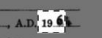 | No. Processor limitation \- can't fix | Sometimes, values are not detected due unclear handwriting and is a processor limitation which can't be fixed. | Can edit field manually to add correct value |
| 2 | Partial value got detected |  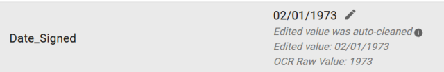 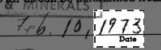| Maybe | Sometimes, values are not detected due unclear handwriting and is a processor limitation which can't be fixed. *But if there are many occurrences, the processor may need to be re-trained to improve identification of the correct location* | Can edit field manually to add correct value   ⚠️Contact OGRRE team only if the issue occurs every time ⚠️ |
| 3 | Value location detected incorrectly | Field ‘X’ may be assigned field ‘Y’ value and location:  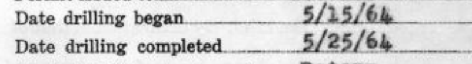 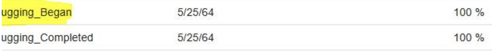| Maybe   | Sometimes due to processor limitations, issues like this may occur.  *But if there are many occurrences, the processor may need to be re-trained to improve identification of the correct location.* | Can edit field manually to add correct value   ⚠️Contact OGRRE team only if the issue occurs every time ⚠️ |
| 4 | Value not detected | Value for a specific field is not identified. In example below, it was not identified but was manually added:  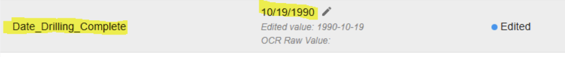 | Maybe  | Sometimes due to OCR limitations, issues like this may occur.  *But if there are many occurrences, the processor may need to be re-trained to improve identification of the correct location.* | Can edit field manually to add correct value   ⚠️Contact OGRRE team only if the issue occurs every time ⚠️ |
| 5 | Checkbox value detected incorrectly | \- Values not detected \- Squares detected instead of true/ false    | No. Processor limitation \- can't fix | Sometimes, values are not detected due unclear text images and is a processor limitation which can't be fixed. Cannot fix it until Google improves their OCR models  | Can edit field manually to add correct value |
| 6 | Complex fieldtype misses detecting some sub-values for different rows | Some values are not detected, making it incompletely digitized section  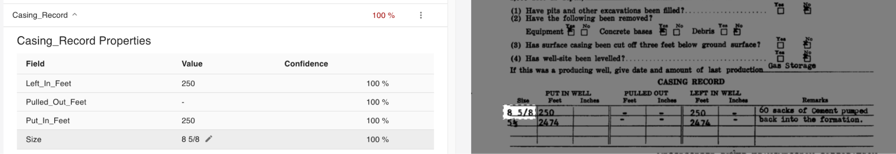| Maybe | Sometimes, values are not detected due unclear handwriting and is a processor limitation which can't be fixed. Raise issue if a particular field is not detected every time, or is not listed in parent action menu as ‘add child field \<field\>’.  | Can edit field manually to add missing children field-value pairs   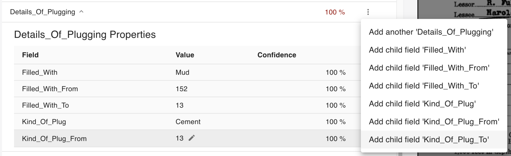  ⚠️Contact OGRRE team only if particular field is not detected every time in all records ⚠️  |
| 7 | Complex fieldtype misses detecting some rows of data |  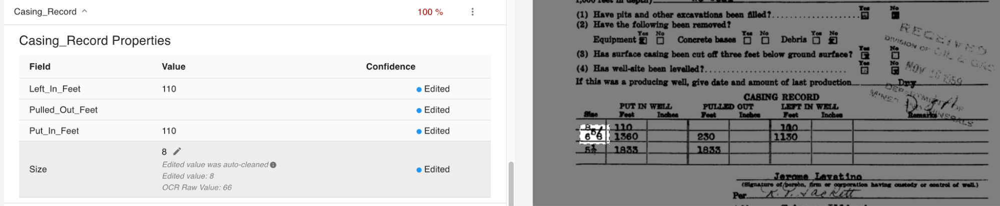| Maybe | Sometimes, values are not detected due unclear handwriting and is a processor limitation which can't be fixed. Raise issue if a particular field is not detected every time, or is not listed in the parent action menu as ‘add another \<field\>’. | Can edit the field manually to add another complex field for missing rows.   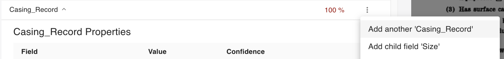  ⚠️Contact OGRRE team only if the issue occurs every time ⚠️ |
| 8 | Signature fields not detected |  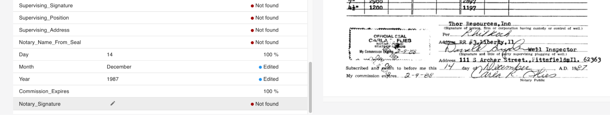| No. Processor limitation \- can't fix | Values are not detected due unclear handwriting and is a processor limitation which can't be fixed until OCR models improve. | Manually edit fields to add values. | 
 

# Schema Issues:

|  | Issue | Image | Fixable? | Notes | Way Around |
| :---- | :---- | :---- | :---- | :---- | :---- |
| 1 | Incorrect schema order on all records | Order of fields on record do not match the scanned document order:  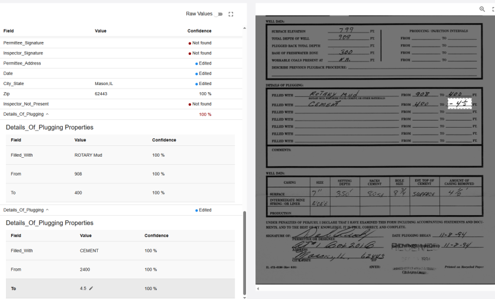| Yes | The schema order is designed for each record group/ processor and can be changed. | *Edit your team’s linked schema ??*    ⚠️Contact OGRRE team if a schema order update is  needed ⚠️  |
| 2 | Some fields detected are not needed |  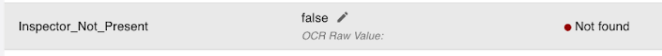| Yes | The schema is designed for each record group/ processor and can be changed. To remove certain fields from UI implies a schema update. | *Edit your team’s linked schema ??*   ⚠️Contact OGRRE team if a schema update is  needed ⚠️  |