# FAQs and Issues

Our platform utilizes advanced AI-powered Optical Character Recognition (OCR)models to enhance the efficiency and accuracy of data extraction. However, like any sophisticated tool, users may encounter various issues that arise from different aspects of the system.

# FAQs

  
 Why are some values incorrect or missing? 

  This usually happens due to:

  - Unclear handwriting
  - Low-quality scans
  - OCR limitations
  - Overwritten/misused fields

  In most cases, you can manually correct the value. If the same issue happens consistently across many records, contact the OGRRE team.

  
 Why is a single boolean type field shown as two fields in the digitized record? 

  This is due to an OCR design limitation. When a document uses separate “Yes” and “No” checkboxes for one question, the system detects them as two individual boolean fields instead of one combined field. 
  This cannot be changed immediately. If needed, the fields can be merged during post-processing (e.g., in Excel or via a script).

  
 Why does the system change my manually edited value? 

  This is caused by the auto-cleaning logic. OGRRE tool automatically formats values to match expected patterns for specific fields. If your edit does not match the accepted format, it may be overwritten or reformatted.
  If you think it is incorrectly handled for any field repeatedly across multiple records, report it to the OGRRE team so the acceptable formats can be updated.

  
 What issues cannot currently be fixed? 

  Some issues are due to OCR processor limitations, including:
    
    - Incorrect detection of unclear handwriting
    - Signature detection failures
    - Some checkbox detection errors

These depend on improvements in the underlying OCR models and may not be immediately fixable.

  
 Can reprocessing the records with retrained AI models fix issues? 

  Reprocessing documents involve deleting current records and reuploading them to get reprocessed against the updated AI processor.  Any progress for the reviewed records like edits will be lost, and records’ status will be marked as ‘Re-digitized’. 
  Consider reprocessing only in case of significant updates to corresponding AI processor, example - missed or incorrectly marked fields.
  For occasional missed detections, retraining the processor and reprocessing records does not guarantee detection improvement.

  
 When should I contact the OGRRE team? 

  Contact the OGRRE team when:
    - The same field is incorrectly detected in many records
    - Auto-cleaning repeatedly incorrectly modifies valid values
    - Field order or unnecessary fields need to be updated
    - A specific simple or complex field is always missing in many records

    For one-off OCR errors, manual correction is usually sufficient.

________

# Example of Common Issues:

Here we list common issues users may stumble upon, we categorize these issues into three primary areas: 

1. **Issue with Detection of Value or Position**: Includes detection issues like wrong value, missing value, partial detection, wrong mapping, nested rows missing, signature detection issues.
2. **Issue with Fields, Type, or Order of Fields**: Includes issues like field split into two checkboxes, complex field structure, wrong order, unnecessary fields.
3. **Issue with Auto-Cleaning**: Includes issues like value cleaned and reformatted incorrectly, manual edits overwritten.

**Issues Table Overview:**

|  | Column | Description |
| :---- | :---- | :---- |
| 1 | Issue  | Issue definition |
| 2 | Example | Brief explanation with an image illustrating the issue |
| 3 | Fixable | Is the issue fixable? (Yes/No) |
| 4 | Notes | Additional information about the issue |
| 5 | Solution | Suggested solutions or alternative methods to address the problem. |

 

#  Issues with Value or Position Detection:
Includes detection issues like wrong value, missing value, partial detection, wrong mapping, nested rows missing, signature detection issues

|  | Issue | Example | Fixable? | Notes | Way Around |
| :---- | :---- | :---- | :---- | :---- | :---- |
| 1 | Value detected incorrectly| Unclear text on documents is captured incorrectly most of the times:  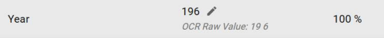 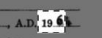 | No. Processor limitation \- can't fix | Sometimes, values are not detected due unclear handwriting and is a processor limitation which can't be fixed. | Can edit field manually to add correct value |
| 2 | Partial value got detected |  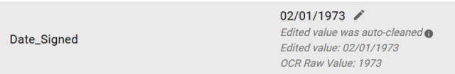 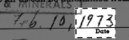| Maybe | Sometimes, values are not detected due unclear handwriting and is a processor limitation which can't be fixed. *But if there are many occurrences, the processor may need to be re-trained to improve identification of the correct location* | Can edit field manually to add correct value   ⚠️Contact OGRRE team only if the issue occurs every time ⚠️ |
| 3 | Value location detected incorrectly | Field ‘X’ may be assigned field ‘Y’ value and location:  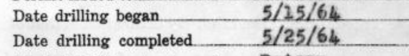 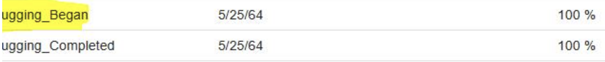| Maybe   | Sometimes due to processor limitations, issues like this may occur.  *But if there are many occurrences, the processor may need to be re-trained to improve identification of the correct location.* | Can edit field manually to add correct value   ⚠️Contact OGRRE team only if the issue occurs every time ⚠️ |
| 4 | Value not detected | Value for a specific field is not identified. In example below, it was not identified but was manually added:  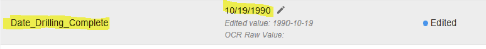 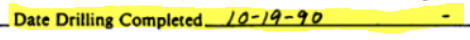| Maybe  | Sometimes due to OCR limitations, issues like this may occur.  *But if there are many occurrences, the processor may need to be re-trained to improve identification of the correct location.* | Can edit field manually to add correct value   ⚠️Contact OGRRE team only if the issue occurs every time ⚠️ |
| 5 | Checkbox value detected incorrectly | \- Values not detected \- Squares detected instead of true/ false  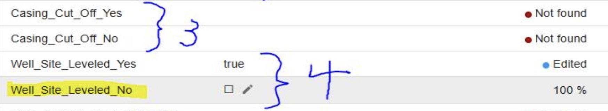 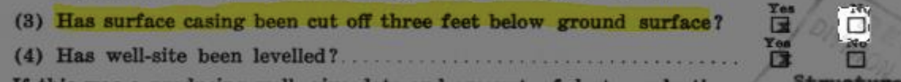 | No. Processor limitation \- can't fix | Sometimes, values are not detected due unclear text images and is a processor limitation which can't be fixed. Cannot fix it until Google improves their OCR models  | Can edit field manually to add correct value |
| 6 | Tabular data detection misses sub-values for particular rows | Some values are not detected, making it incompletely digitized section  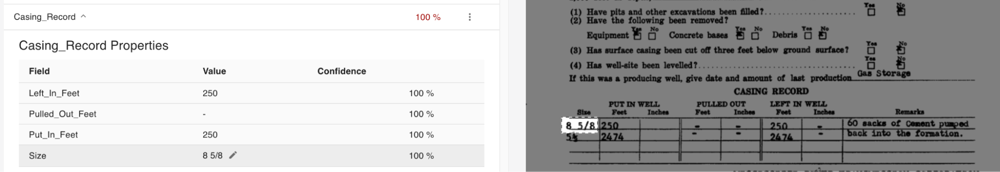| Maybe | Sometimes, values are not detected due unclear handwriting and is a processor limitation which can't be fixed. Raise issue if a particular field is not detected every time, or is not listed in parent action menu as ‘add child field \<field\>’.  | Can edit field manually to add missing children field-value pairs   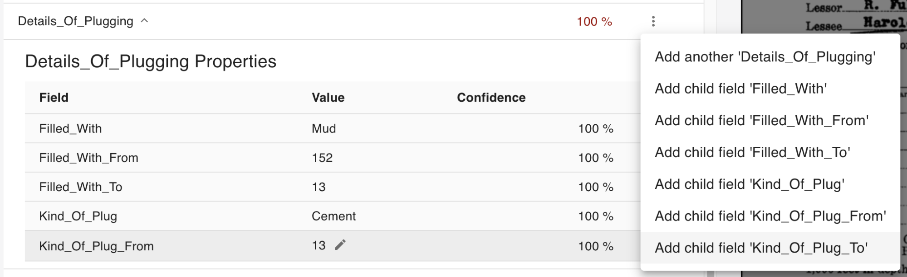  ⚠️Contact OGRRE team only if particular field is not detected every time in all records ⚠️  |
| 7 |Tabular data detection misses multiple rows |  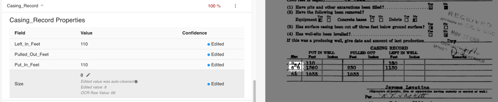| Maybe | Sometimes, values are not detected due unclear handwriting and is a processor limitation which can't be fixed. Raise issue if a particular field is not detected every time, or is not listed in the parent action menu as ‘add another \<field\>’. | Can edit the field manually to add another complex field for missing rows.   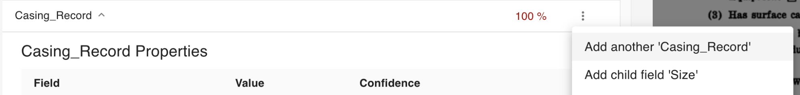  ⚠️Contact OGRRE team only if the issue occurs every time ⚠️ |
| 8 | Signature fields not detected |  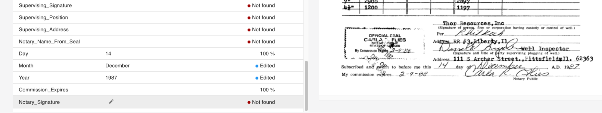| No. Processor limitation \- can't fix | Values are not detected due unclear handwriting and is a processor limitation which can't be fixed until OCR models improve. | Manually edit fields to add values. | 
| 9 | Fields marked ‘not found’ but contain an incorrect value |  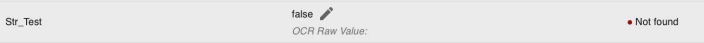| Yes | Mostly an auto-cleaning issue. Raise issue to discuss auto-cleaning function for this field if it happens every time. Auto-cleaning function needs to update to allow empty values  | ⚠️Contact OGRRE team to fix this issue ⚠️   No way around. Mark the record to revisit after discussing with the OGRRE team. |
 

# Issue with Fields, Type, or Order of Fields:
Includes issues like field split into two checkboxes, complex field structure, wrong order, unnecessary fields.

|  | Issue | Example | Fixable | Notes | Way Around |
| :---- | :---- | :---- | :---- | :---- | :---- |
| 1 | Yes/No fields have two boolean fields associated instead of one | Two fields detected instead of one boolean:   | Not as of now. | Processor limitation necessitated splitting this into two fields.    Additional processing to merge two fields into one is possible, but is a larger effort for OGRRE team, and needs schema discussions to discuss feasibility | OGRRE users can write post processing scripts or excel formulas for the exported data, to merge these values into one boolean field. |
| 2 | Tabular/ complex data shown as multiple nested fields |  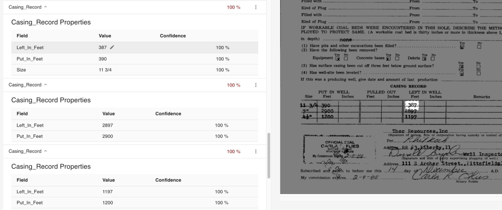| No | This is by design of the tool, and was necessary to support  showing the confidence and raw value fields for all the sub-values | NA |
| 3 | Incorrect schema order on all records | Order of fields on record do not match the scanned document order:  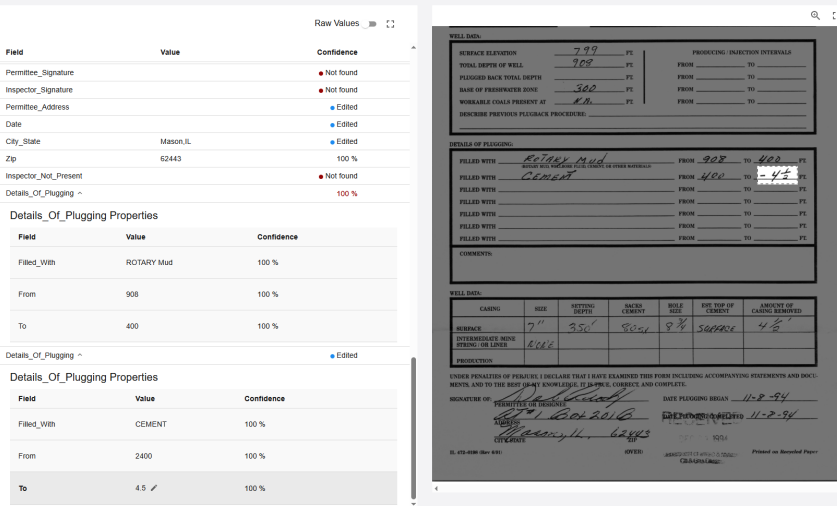| Yes | The schema order is designed for each record group/ processor and can be changed. |    ⚠️Contact OGRRE team if a schema order update is  needed ⚠️  |
| 4 | Some fields detected are not needed |  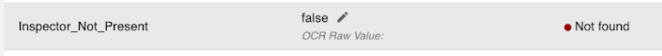| Yes | The schema is designed for each record group/ processor and can be changed. To remove certain fields from UI implies a schema update. |   ⚠️Contact OGRRE team if a schema update is  needed ⚠️  |
 

# Schema Issues:

|  | Issue | Image | Fixable? | Notes | Way Around |
| :---- | :---- | :---- | :---- | :---- | :---- |
| 1 | Auto-cleaning edits the value incorrectly or in incorrect format | Even if value is manually edited, auto-cleaning edits it to something else:   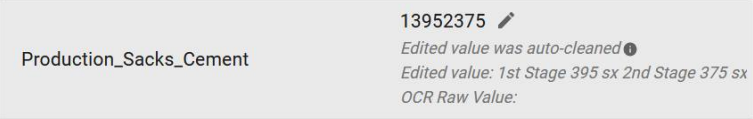| Yes | Raise issue to discuss auto-cleaning function for this field Auto-cleaning function needs to update the acceptable value formats | ⚠️Contact OGRRE team to fix this issue ⚠️    No way around. Mark the record to revisit after discussing with the OGRRE team. |
| 2 | Fields marked ‘not found’ but contain an incorrect value |  | Yes | Mostly an auto-cleaning issue. Raise issue to discuss auto-cleaning function for this field if it happens every time. Auto-cleaning function needs to update to allow empty values  | ⚠️Contact OGRRE team to fix this issue ⚠️   No way around. Mark the record to revisit after discussing with the OGRRE team. |
